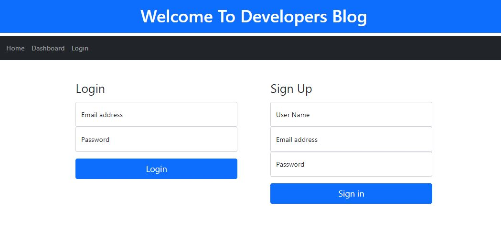

# Developers Tech Blog

 [](https://opensource.org/licenses/MIT)
 [](https://thawing-hamlet-74403.herokuapp.com/)


  ## Table of contents
  - [Description](#description)
  - [Installation instructions](#installation-instructions)
  - [Usage information](#usage-information)
  - [License](#license)
  - [Questions](#questions)


  ## Description

   [Check it on HEROKU](https://thawing-hamlet-74403.herokuapp.com/)
  
  


  #### For this project the following technologies were used:
  * Nodejs
  * npm dotenv
  * npm express, express-session, express-handlebars
  * npm mysql2
  * npm sequelize
  * npm bcrypt
  * npm handlebars
  * Insomnia 
  * CSS Bootstrap 


  ## Installation instructions

  For dependancies run following comand:

  ```npm i```

  ## Usage information

  To load the database use the following commands:

  ``mysql -u root -p``

  ``source db/schema.sql``
  

  To use this app on localhost - run the following commands:

  ``npm run seed``

  ``npm start``

  ## License

  [](https://opensource.org/licenses/MIT)

  Usage is provided under [The MIT License](https://opensource.org/licenses/MIT). See LICENSE for the full details.

  ## Questions

  To reach me with additional questions

  GitHub: [Juliusm9791](https://github.com/Juliusm9791)

  Email: juliusm9791@gmail.com

